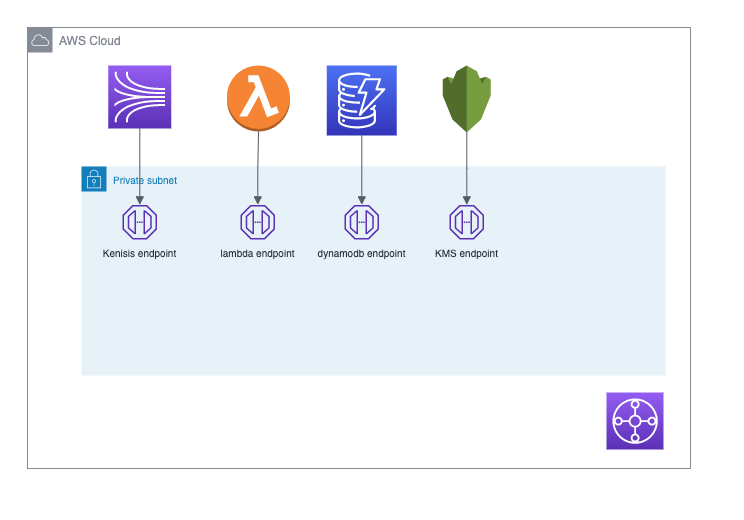

## serverless-datapipeline-in-privatesubnet

This is working example is used to demostrate to enterprise customer who has very strict cyber security control requirement in place, and they requires lambda to run inside VPC without internet access but also need to access other serverless service like DynamoDB and Kinesis as well as KMS via private endpoint.

By deploying the single cloudformation file, you will get a working example data pipeline to demostrate, 

publisher lambda --> kinesis --> consumer lambda --> dynamodb

Publisher lambda will also access KMS service via kms endpoint to encrypt the payload; consumer lambda being triggerred by Kinesis message and will access the kms endpoint to decrypt the payload as well.




In this exmample lambda runs in a fully private VPC without any internet access,

*  The publisher lambda will be triggered to send kineisis message record by cloudwatch event scheduler every minute 
*  The consumer Lambda will be triggered by Kinesis message
*  The consumer Lambda will read the kinesis message payload and write to dynamodb

Please note,

* The demo focus on configurations to make the pipeline work in fully private subnet
* Performance of data pipeline itself is not the foucs thus no pipeline error handling and performance considered

## How to deploy 

This sample runs in ap-southeast-2 region, if you want to use other region, please update DynamodbPrefixList parameter while deploying the cloudformation.

```
aws cloudformation deploy --template-file ./cfn-kinesis-lambda-dynamo-privatesubnet.yml --stack-name cfn-kinesis-lambda-dynamo-privatesubnet --capabilities CAPABILITY_NAMED_IAM
```

## Reference Link

vpce-gateway route table explained
>
https://docs.aws.amazon.com/vpc/latest/privatelink/vpce-gateway.html

## Security

See [CONTRIBUTING](CONTRIBUTING.md#security-issue-notifications) for more information.

## License

This library is licensed under the MIT-0 License. See the LICENSE file.

